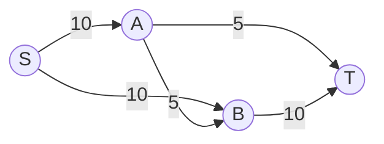
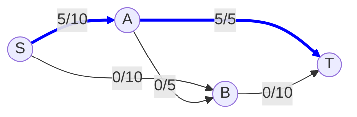
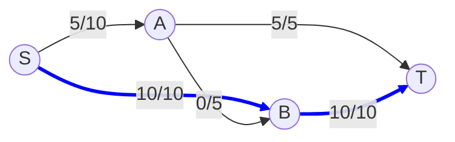
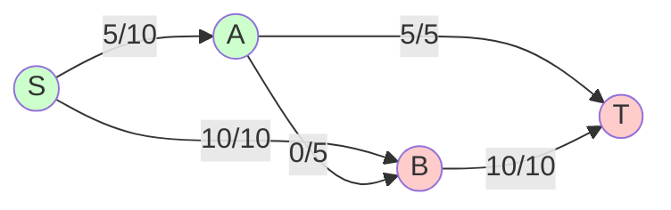

# Exercices Corrigés - Flots

Voici les corrections pour la série d'exercices sur les flots.

## Exercice 1 : Algorithme de Ford-Fulkerson

*(Note : Le graphe n'étant pas visible, voici la méthode générale pour résoudre cet exercice)*

**1. Exécution de l'algorithme**

<video controls width="100%" autoplay loop muted>
  <source src="../img/ford_fulkerson.webm" type="video/webm">
  <source src="../img/ford_fulkerson.mp4" type="video/mp4">
  Your browser does not support the video tag.
</video>

````carousel
<!-- slide -->
**État Initial**
Capacités affichées sur les arcs. Flot = 0.



<!-- slide -->
**Itération 1 : Chemin S -> A -> T**
On envoie 5 unités (limité par A->T).
Flot Total = 5.



<!-- slide -->
**Itération 2 : Chemin S -> B -> T**
On envoie 10 unités (limité par S->B et B->T).
Flot Total = 5 + 10 = 15.



<!-- slide -->
**Itération 3 : Chemin S -> A -> B -> T ?**
Impossible car B->T est saturé (10/10) et A->T est saturé (5/5).
Cependant, si on avait A->B avec capacité restante, on pourrait passer.
Ici, le flot est bloqué. Max Flow = 15.


*(En vert : sommets accessibles depuis S dans le résiduel. En rouge : inaccessibles. La coupe min est {A->T, S->B, A->B} ... attendez, S->B est saturé, A->T est saturé. Coupe = {S->B, A->T, A->B} ? Non, A->B a cap 5 et flot 0. Coupe Min = {S->B, A->T} de capacité 10+5=15).*
````

L'algorithme de Ford-Fulkerson fonctionne par itérations successives :
1.  **Initialisation :** Le flot est nul partout.
2.  **Recherche de chemin augmentant :** On cherche un chemin de la source (s) vers le puits (t) dans le graphe résiduel.
    *   Le graphe résiduel contient les arcs où il reste de la capacité (capacité - flot actuel > 0) et les arcs inverses là où il y a déjà du flot (pour pouvoir l'annuler).
3.  **Augmentation :** Si on trouve un chemin, on calcule la capacité résiduelle minimale sur ce chemin (le "goulot d'étranglement"). On augmente le flot de cette valeur le long du chemin.
4.  **Répétition :** On recommence tant qu'on trouve un chemin augmentant.
5.  **Arrêt :** Quand il n'y a plus de chemin de s à t, on a trouvé le flot maximum.

**2. Valeur du flot maximum**
C'est la somme des flots sortant de la source (ou entrant dans le puits) à la fin de l'algorithme.

**3. Coupe minimum**
La coupe minimum correspond à l'ensemble des arcs qui saturent et bloquent le passage.
Pour la trouver :
1.  À la fin de l'algorithme, marquez tous les sommets accessibles depuis la source dans le graphe résiduel. Appelons cet ensemble S.
2.  Les autres sommets forment l'ensemble T.
3.  La coupe minimum est constituée de tous les arcs qui vont d'un sommet de S vers un sommet de T dans le graphe original.
4.  La somme des capacités de ces arcs est égale à la valeur du flot maximum (Théorème Max-Flow Min-Cut).

---

## Exercice 2 : Réalisation d'une séquence de degrés (Graphe Biparti)

**Données :** Deux séquences d'entiers r = (r1, ..., rn) et b = (b1, ..., bm) telles que la somme des r_i est égale à la somme des b_j.
**Problème :** Existe-t-il un graphe biparti avec ces degrés ?

**1. Modélisation en Flot Maximum**
On construit un réseau de transport :
*   Une **Source S** et un **Puits T**.
*   Des nœuds pour chaque élément de R (gauche) et chaque élément de B (droite).
*   **Arcs S -> R_i** : Capacité = r_i (On veut que le sommet R_i ait exactement r_i arêtes, donc on lui envoie r_i unités de flot).
*   **Arcs B_j -> T** : Capacité = b_j (De même pour B_j).
*   **Arcs R_i -> B_j** : Capacité = 1 (Entre chaque paire, il peut y avoir au maximum 1 arête car c'est un graphe simple). On met un arc de chaque R_i vers chaque B_j.

**Condition d'existence :**
Il existe un graphe biparti respectant les degrés SI ET SEULEMENT SI le flot maximum dans ce réseau sature tous les arcs sortant de la source (et donc tous ceux entrant dans le puits).
C'est-à-dire : **Flot Max = Somme des r_i**.

**2. Contre-exemple**
Prenons n=1, m=1.
*   r = (2)
*   b = (2)
*   Somme r = 2, Somme b = 2. L'équation est vérifiée.
*   Cependant, on a un seul sommet à gauche et un seul à droite.
*   Dans un graphe simple, on ne peut mettre qu'une seule arête entre eux.
*   Les degrés seront donc au maximum 1. Impossible d'avoir degré 2.

**3. Extension : Une seule séquence d (Graphe non orienté)**
Peut-on savoir si une séquence d = (d1, ..., dn) correspond à un graphe non orienté simple ?
Oui, on peut aussi modéliser cela avec des flots, mais c'est plus subtil.
*   On crée une source S et un puits T.
*   On crée des nœuds représentant toutes les **paires possibles** {i, j} (les arêtes potentielles).
*   On crée des nœuds pour chaque sommet i.
*   **Arcs S -> Paire_{i,j}** : Capacité = 1 (Chaque arête existe ou non).
*   **Arcs Paire_{i,j} -> Sommet i** et **Paire_{i,j} -> Sommet j** : Capacité = 1 (Si l'arête est choisie, elle contribue au degré de i et de j).
*   **Arcs Sommet i -> T** : Capacité = d_i (Le degré voulu).

Le problème a une solution si le flot max sature tous les arcs vers T (Flot Max = Somme des d_i).
*(Note : En pratique, pour ce problème spécifique, l'algorithme de Havel-Hakimi est plus simple et plus utilisé que les flots).*
