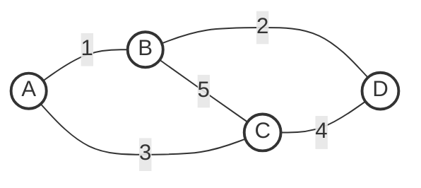
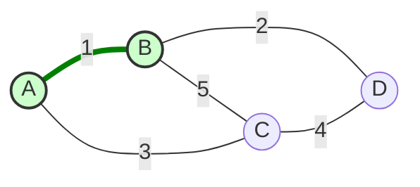
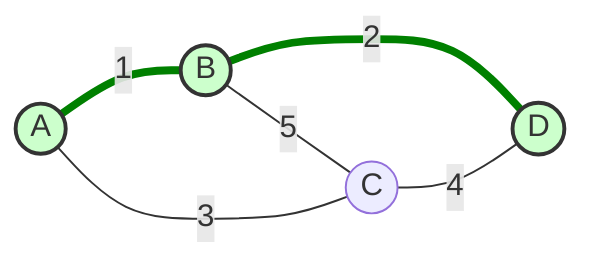
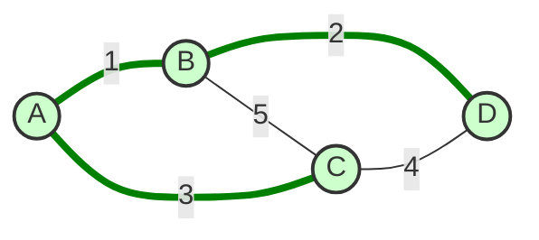
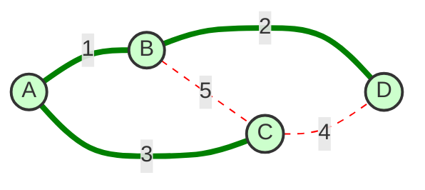
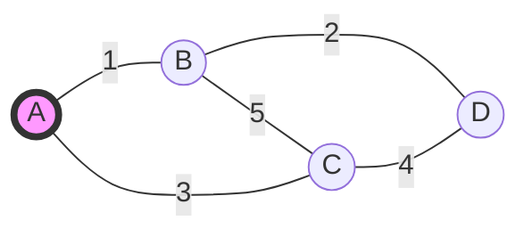
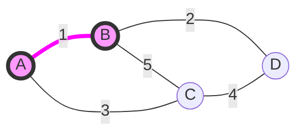
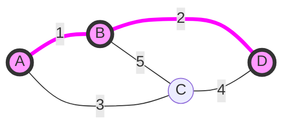
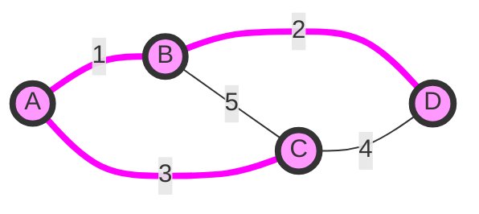

# Algorithmes de Kruskal et Prim

Ce document détaille deux algorithmes fondamentaux pour trouver un **Arbre Couvrant Minimum** (ACM) dans un graphe.

## Introduction : Arbre Couvrant Minimum (ACM)

Imaginez un réseau de villes reliées par des routes, où chaque route a un coût de construction. Un **Arbre Couvrant Minimum** est un moyen de relier toutes les villes entre elles en utilisant le moins de routes possible et pour le coût total le plus bas. Il ne doit pas y avoir de boucles (cycles) : il y a juste assez de routes pour que tout le monde soit connecté.

---

## 1. Algorithme de Kruskal

### But
Construire le réseau en choisissant toujours la route la moins chère disponible, tant qu'elle ne crée pas de boucle inutile.

### Principe
L'algorithme de Kruskal est une approche **gloutonne** (on prend le meilleur choix immédiat) qui se concentre sur les **arêtes** (les routes).
1. On classe toutes les routes de la moins chère à la plus chère.
2. On regarde chaque route une par une. Si elle permet de relier deux zones qui n'étaient pas encore connectées ensemble, on la garde. Sinon (si les deux zones sont déjà reliées par un autre chemin), on la jette car elle créerait une boucle.

### Étapes détaillées
1.  **Initialisation** : Au début, chaque ville est isolée, comme si elle était sa propre petite île.
2.  **Tri** : On fait une liste de toutes les routes possibles, triées par coût croissant (de la moins chère à la plus chère).
3.  **Boucle** : On prend la première route de la liste (la moins chère) :
    *   Est-ce que cette route relie deux groupes de villes différents ?
    *   **OUI** : On construit la route. Les deux groupes de villes fusionnent pour n'en former qu'un seul plus grand.
    *   **NON** : Les deux villes sont déjà connectées (directement ou via d'autres villes). On ignore cette route pour éviter de faire un circuit fermé.
4.  **Fin** : On s'arrête quand toutes les villes sont connectées ensemble.

### Complexité (Efficacité)
L'étape la plus longue est de trier toutes les routes par prix. Ensuite, vérifier si deux villes sont déjà connectées est très rapide grâce à des structures de données optimisées. C'est un algorithme efficace même pour des graphes assez grands.

### Trace d'exécution (Exemple)

<video controls width="100%" autoplay loop muted>
  <source src="../img/kruskal.webm" type="video/webm">
  <source src="../img/kruskal.mp4" type="video/mp4">
  Your browser does not support the video tag.
</video>

````carousel
<!-- slide -->
**Étape 0 : Initialisation**
Toutes les arêtes sont grises. Aucun sommet n'est connecté.



<!-- slide -->
**Étape 1 : Arête (A, B) - Poids 1**
On choisit l'arête la moins chère. Elle ne crée pas de cycle.



<!-- slide -->
**Étape 2 : Arête (B, D) - Poids 2**
La suivante est (B, D). Elle connecte D au groupe {A, B}.



<!-- slide -->
**Étape 3 : Arête (A, C) - Poids 3**
La suivante est (A, C). Elle connecte C au reste.



<!-- slide -->
**Étape 4 : Fin**
Les arêtes restantes (C, D) et (B, C) créeraient des cycles (tous les sommets sont déjà connectés). L'algorithme s'arrête.


````

Soit le graphe suivant :
*   Sommets : A, B, C, D
*   Arêtes :
    *   (A, B) : 1
    *   (B, D) : 2
    *   (A, C) : 3
    *   (C, D) : 4
    *   (B, C) : 5

(Les routes C-D et B-C sont ignorées car elles relieraient des villes déjà connectées au réseau).

---

## 2. Algorithme de Prim

### But
Construire le réseau en partant d'une ville et en s'étendant petit à petit vers les villes voisines les plus proches.

### Principe
L'algorithme de Prim est aussi une approche **gloutonne**, mais qui se concentre sur les **sommets** (les villes).
1. On choisit une ville de départ au hasard.
2. À chaque étape, on regarde toutes les routes qui partent des villes déjà connectées vers l'extérieur. On choisit la moins chère pour ajouter une nouvelle ville au réseau.

### Étapes détaillées
1.  **Initialisation** : On choisit une ville de départ (n'importe laquelle). C'est notre "réseau actuel".
2.  **Boucle** : Tant qu'il reste des villes non connectées :
    *   On regarde toutes les routes possibles qui partent d'une ville **dans** notre réseau vers une ville **hors** de notre réseau.
    *   On choisit la route la moins chère parmi celles-ci.
    *   On ajoute cette route et la nouvelle ville à notre réseau.
3.  **Fin** : Quand toutes les villes sont dans le réseau.

### Complexité (Efficacité)
L'efficacité dépend de la façon dont on trouve rapidement la prochaine route la moins chère. C'est généralement très efficace, surtout si le réseau a beaucoup de routes (graphe dense).

### Trace d'exécution (Même exemple)

<video controls width="100%" autoplay loop muted>
  <source src="../img/prim.webm" type="video/webm">
  <source src="../img/prim.mp4" type="video/mp4">
  Your browser does not support the video tag.
</video>

````carousel
<!-- slide -->
**Étape 0 : Initialisation**
On part de A.



<!-- slide -->
**Étape 1 : Choix (A, B)**
Voisins de A : B(1), C(3). Le min est B.



<!-- slide -->
**Étape 2 : Choix (B, D)**
Voisins accessibles : C(3) [via A], D(2) [via B], C(5) [via B]. Le min est D(2).



<!-- slide -->
**Étape 3 : Choix (A, C)**
Voisins accessibles : C(3) [via A], C(5) [via B], C(4) [via D]. Le min est C(3).


````

Graphe :
*   Sommets : A, B, C, D
*   Arêtes : (A,B):1, (B,D):2, (A,C):3, (C,D):4, (B,C):5

---

## Résumé Comparatif

| Caractéristique | Kruskal | Prim |
| :--- | :--- | :--- |
| **Idée principale** | On trie toutes les routes et on prend les moins chères (si pas de boucle). | On part d'une ville et on grandit comme une tache d'huile vers la plus proche. |
| **Approche** | Globale (on regarde toutes les routes d'un coup). | Locale (on regarde juste autour de ce qu'on a déjà). |
| **Meilleur usage** | Quand il y a peu de routes (graphe "aéré"). | Quand il y a beaucoup de routes (graphe "dense"). |
